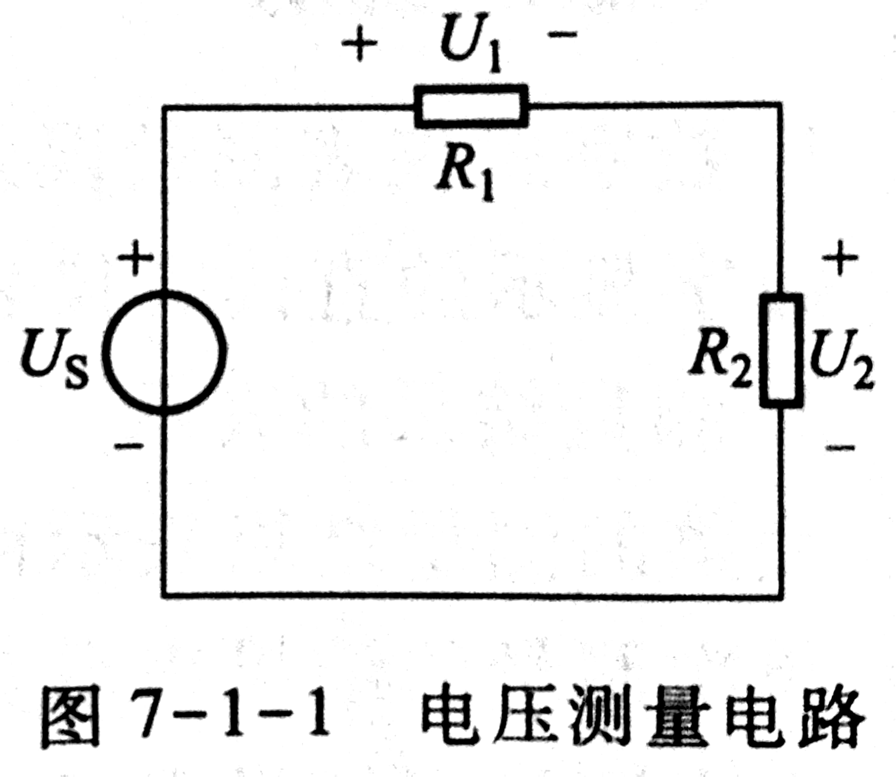
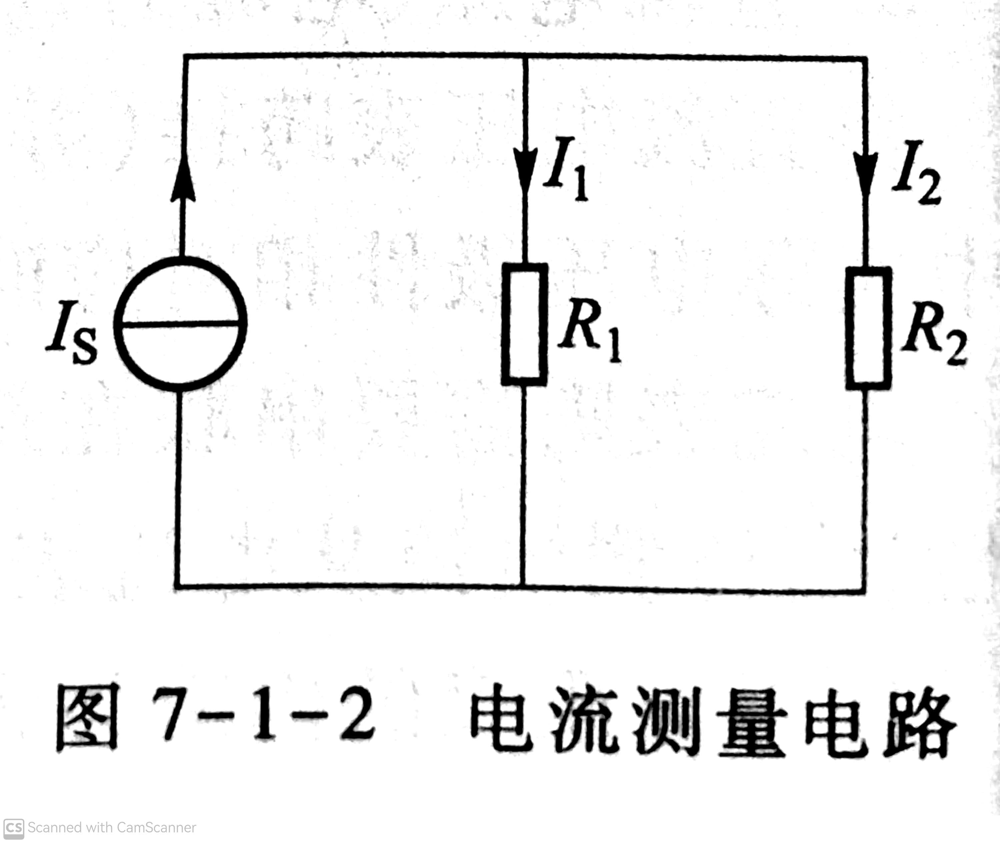

# 電路與電子技術實驗報告

# 實驗1—直流電壓電流和電阻的測量

## 一、實驗目的和要求

### 實驗目的

1. 掌握直流電源、測量儀表以及數位萬用電錶的使用方法；
2. 掌握直流電壓、電流和電阻的直接測量方法；
3. 了解測量儀表量程、解析度、準確度對測量結果的影響；
4. 學習如何正確表示測量結果。

### 實驗要求

1. 請不要帶食物進入實驗室，更不允許在實驗室用餐；
2. 請勿大聲喧嘩，不要隨意走動，不要私自更換實驗設備；
3. 請聽從實驗指導老師的安排，獨立完成實驗；
4. 實驗完畢請關閉電源，萬用電表用完後關閉電源歸還，並擺放整齊；整理實驗桌面，保持實驗室整潔；
5. 請注意用電安全，包括人身安全和設備安全；
6. 文明實驗。

## 二、實驗內容和原理

### 實驗內容

直流電壓電流和電阻的測量。

### 實驗原理

1. 數位式儀表測量誤差計算方法
   
   數字顯示的直讀式儀表,其誤差的計算公式為
    $$\Delta = x - x_0 \text{,}$$
    $$\delta = \frac{\Delta}{x-x_0} \times 100\% \text{。}$$

2. 測量結果的表示
   
   完整的測量結果表示由「量值、不確定度和單位」三部分組成。
   
   單次測量的結果表示為：$x \pm u \; (P = \rho)$ (單位)，其中，$u$，$P$ 分別是測量的不確定度和置信機率。
   
   多次測量的結果以：$\overline x \pm u \; (P = \rho)$ (單位)，其中 $\overline{x}$ 為多次測量的平均值。
   
   對於普通精度實驗中的少次數測量，可直接以儀器誤差 $\Delta_儀$ 表示測量的不確定度，即 $u = \Delta_儀$。
   
3. 直流電壓、電流的直接測量
   
   將直流電壓表跨接（並聯）在待測電壓處，可以測量其電壓值。直流電壓表的正負極性與電路中實際電壓極性相對應時，才能正確測得電壓值。

    電流表則需要串聯在待測支路中才能測量在該支路中流動的電流。電流表兩端也標示正負極性,當待測電流從電流表的「正」流到「負」時，電流表顯示為正值。

    理想電壓表的內阻為無窮大，理想電流表的內阻為零。但是,如果電壓（電流）表的內阻為有限量,則當該電壓（電流）表接入電路時，將會改變原來的電路工作狀態，從而使待測電壓（電流）產生誤差。
    
    直流儀表的測量誤差通常由其說明書上的計算公式給出,與測量值以及量程大小有關。

4. 電阻的直接測量

    電阻的直接測量通常可用萬用表（電阻表）、電橋、電參數測量儀LCR來測量。電阻的測量誤差由該儀表說明書上的計算公式給出，與測量值以及量程大小有關。

## 三、主要儀器設備

直流穩壓電源、直流穩流電源、十進制電阻箱、數位直流電壓表、數位直流電流表、數位萬用表、電阻、導線、電工綜合實驗台和電容器。

## 四、操作方法和實驗步驟

1. 仔細閱讀實驗室各實驗裝置、儀器儀表的使用手冊,了解本次實驗所用的數位萬用電錶、直流電源、數位直流電壓（電流）表的技術性能指標。

2. 用數位萬用電表分別測量。
    
    (1) 當十進位電阻箱的指示值分別為2 $\Omega$、5 $\Omega$、200 $\Omega$、5000 $\Omega$、9999 $\Omega$、50 $\mathrm{k}\Omega$ 時的電阻值，測量資料填入表7-1-1（見下文）。

    (2) 指定電容器的電容值，測量資料填入表7-1-2（見下文）。

3. 以數位萬用電錶和數位直流電壓表分別測量直流電壓。

    依圖7-1-1接線，其中 $U_S \approx 15 \, \mathrm{V}$，為直流穩壓電源；$R_1$的標稱值為200 $\mathrm{k}\Omega$，$R_2$的標稱值為50 $\mathrm{k}\Omega$。分別以數位萬用電錶的直流電壓擋和數位直流電壓表測量$U_S$、$U_1$和$U_2$，測量數據（包括測量值與量程）填入表7-1-3（見下文）。

    

4. 用直流電流表測量直流電流。
    
    按圖7-1-2接線，其中 $I_S \approx 18 \, \mathrm{mA}$，為直流穩流電源。以直流電流表20 mA量程測量以下兩種情況下的$I_S$、$I_1$和$I_2$，測量數據（包括測量值與量程）填入表7-1-4（見下文）。

    

5. 拓展。

    圖7-1-2中取$I_S = 190 \, \mathrm{mA}, R_1 = R_2 = 2 \, \mathrm{k} \Omega$。以直流電流表測量$I_S$、$I_1$和$I_2$，測量數據（包括測量值與量程）填入表7-1-5（見下文）。

## 五、實驗數據紀錄和處理

**
表7-1-1 用數字萬用表測量電阻
**

| 電阻指示值/$\Omega$ |               2               |               50               |               200               |                        5 000                        |                        9 999                         |                         50 k                         |
| :-----------------: | :---------------------------: | :----------------------------: | :-----------------------------: | :-------------------------------------------------: | :--------------------------------------------------: | :--------------------------------------------------: |
|     測量值/量程     | 2.7$\, \Omega$/600$\, \Omega$ | 51.4$\, \Omega$/600$\, \Omega$ | 199.2$\, \Omega$/600$\, \Omega$ | 5.069$\, \mathrm{k} \Omega$/6$\, \mathrm{k} \Omega$ | 10.11$\, \mathrm{k} \Omega$/60$\, \mathrm{k} \Omega$ | 49.62$\, \mathrm{k} \Omega$/60$\, \mathrm{k} \Omega$ |

**
表7-1-2 用數字萬用表測量電容
**

| 電容標稱值/$\mathrm{\mu F}$ |                     0.1                     |                    0.47                     |                         1                         |                        47                         |                       1 000                       |
| :-------------------------: | :-----------------------------------------: | :-----------------------------------------: | :-----------------------------------------------: | :-----------------------------------------------: | :-----------------------------------------------: |
|         測量值/量程         | 107.0$\, \mathrm{nF}$/999.9$\, \mathrm{nF}$ | 505.5$\, \mathrm{nF}$/999.9$\, \mathrm{nF}$ | 1.050$\, \mathrm{\mu F}$/9.999$\, \mathrm{\mu F}$ | 46.45$\, \mathrm{\mu F}$/99.99$\, \mathrm{\mu F}$ | 945.7$\, \mathrm{\mu F}$/999.9$\, \mathrm{\mu F}$ |

**
表7-1-3 測量直流電壓
**

|                      |  $U_S$/V   |  $U_1$/V   |  $U_2$/V  |
| :------------------: | :--------: | :--------: | :-------: |
|   用數位萬用表測量   | 15.08V/60V | 12.01V/60V | 2.998V/6V |
| 用數位直流電壓表測量 | 15.12V/20V | 11.21V/20V | 2.77V/20V |

**
表7-1-4 測量直流電流
**

|                                               |   $I_S$/mA   |  $I_1$/mA   |  $I_2$/mA   |
| :-------------------------------------------: | :----------: | :---------: | :---------: |
|      $R_1$、$R_2$標稱值均為20$\, \Omega$      | 18.05mA/20mA | 7.92mA/20mA | 7.94mA/20mA |
| $R_1$、$R_2$標稱值均為2$\, \mathrm{k \Omega}$ | 18.05mA/20mA | 8.95mA/20mA | 8.95mA/20mA |

**
表7-1-5 拓展
**

|                                               |   $I_S$/mA   |   $I_1$/mA   |   $I_2$/mA   |
| :-------------------------------------------: | :----------: | :----------: | :----------: |
| $R_1$、$R_2$標稱值均為2$\, \mathrm{k \Omega}$ | 34.7mA/200mA | 17.2mA/200mA | 17.3mA/200mA |

### 計算測量電阻時的儀表誤差

依照儀表誤差公式：$\Delta x = \pm (a \% \times 讀數 + n \times 分辨率)$計算儀表誤差，並將結果填入以下表格7-1-1.1~7-1-5.1：

**
表7-1-1.1 用數字萬用表測量電阻時的儀表誤差
**

| 電阻指示值/$\Omega$ |           2            |           50           |          200           |               5 000                |               9 999               |               50 k                |
| :-----------------: | :--------------------: | :--------------------: | :--------------------: | :--------------------------------: | :-------------------------------: | :-------------------------------: |
|      儀表誤差       | $\pm 0.3216 \, \Omega$ | $\pm 0.7112 \, \Omega$ | $\pm 1.8936 \, \Omega$ | $\pm 0.043552 \, \mathrm{k}\Omega$ | $\pm 0.11088 \, \mathrm{k}\Omega$ | $\pm 0.42696 \, \mathrm{k}\Omega$ |

**
表7-1-2.1 用數字萬用表測量電容時的儀表誤差
**

| 電容標稱值/$\mathrm{\mu F}$ |            0.1             |             0.47             |                1                |               47                |              1 000              |
| :-------------------------: | :------------------------: | :--------------------------: | :-----------------------------: | :-----------------------------: | :-----------------------------: |
|          儀表誤差           | $\pm$ 3.71$\, \mathrm{nF}$ | $\pm$ 15.665$\, \mathrm{nF}$ | $\pm$ 0.0365$\, \mathrm{\mu F}$ | $\pm$ 1.4435$\, \mathrm{\mu F}$ | $\pm$ 28.871$\, \mathrm{\mu F}$ |

**
表7-1-3.1 測量直流電壓時的儀表誤差
**

|                                  |                  $U_S$/V                   |                  $U_1$/V                   |                  $U_2$/V                   |
| :------------------------------: | :----------------------------------------: | :----------------------------------------: | :----------------------------------------: |
|   用數位萬用表測量時的儀表誤差   | $\pm$ $1.508 \times 10^{-3} \, \mathrm{V}$ | $\pm$ $1.201 \times 10^{-3} \, \mathrm{V}$ | $\pm$ $2.998 \times 10^{-5} \, \mathrm{V}$ |
| 用數位直流電壓表測量時的儀表誤差 |               $\pm$ 0.0756V                |               $\pm$ 0.05605V               |               $\pm$ 0.01385V               |

**
表7-1-4.1 測量直流電流時的儀表誤差
**

|                                                            |    $I_S$/mA     |    $I_1$/mA     |    $I_2$/mA     |
| :--------------------------------------------------------: | :-------------: | :-------------: | :-------------: |
|      $R_1$、$R_2$標稱值均為20$\, \Omega$ 時的儀表誤差      | $\pm$ 0.09025mA | $\pm$ 0.0396mA  | $\pm$ 0.0397mA  |
| $R_1$、$R_2$標稱值均為2$\, \mathrm{k \Omega}$ 時的儀表誤差 | $\pm$ 0.09025mA | $\pm$ 0.04475mA | $\pm$ 0.04475mA |

**
表7-1-5.1 拓展時的儀表誤差
**

|                                                            |    $I_S$/mA    |   $I_1$/mA    |    $I_2$/mA    |
| :--------------------------------------------------------: | :------------: | :-----------: | :------------: |
| $R_1$、$R_2$標稱值均為2$\, \mathrm{k \Omega}$ 時的儀表誤差 | $\pm$ 0.1735mA | $\pm$ 0.086mA | $\pm$ 0.0865mA |

## 六、實驗結果與分析

表7-1-1~7-1-4中的實驗結果都與預期相符，但表7-1-5的結果與理論預期大相逕庭。不過，這一切都可以解釋。

所有測量的結果都存在誤差，實驗誤差產生的原因主要來自於元件的誤差和儀器的誤差。元件的誤差是標稱值和真實值之間的差距，儀器的誤差則是測量值與真實值之間的差距。由於所有電源都不是理想電源，所有的電錶也都不是理想電錶（電錶內阻影響測量結果），故儀器測量一定存在誤差。此外，由於人在進行實驗操作，故人也可能造成一些誤差。

透過表7-1-3.1，我們可以看出數位萬用表的測量誤差明顯低於數位直流電壓表。

表7-1-5中的結果與預期不符，$I_S \not \approx 190 \, \mathrm{mA}$，原因在於我們實驗所用的電流源有功率6W的限制。在電流為190mA時，功率顯然已經超限，所以輸出的電流被限制在約35mA，即我們測試的結果。

## 七、討論、心得

本次實驗令我初步了解了電路實驗室，懂得了基本元器件的使用方法，還令我學會了誤差的分析。本次實驗加強了我的動手能力，培養了我的科學、嚴謹的意識。希望我能在以後的實驗中學到更多！
